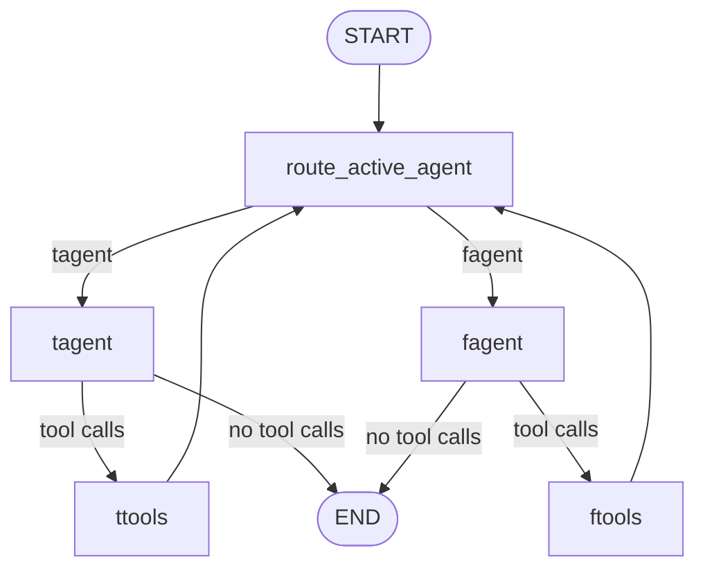

# MBTI primitive swarm simulation

[한국어](./README.md) | English

This folder contains a learning-oriented MBTI T/F swarm simulation built from LangGraph primitives. It intentionally avoids `create_swarm` and `create_react_agent` so the architecture is visible.

## Graph shape



## Key learning point

The swarm is one parent graph with two agent nodes. Handoff is implemented by tool results that update `active_agent`; after tool execution, the router sends control to the active agent.

```text
handoff tool -> custom tool node -> active_agent update -> router -> next agent
```

## Files

| File | Responsibility |
| --- | --- |
| `graph.py` | Primitive swarm implementation with explicit agent/tool/router nodes |
| `swarm_reference.py` | Helper-based reference implementation for comparison |
| `README.reference.md` | Notes comparing primitive and helper-based approaches |

## Status

This is a `simulation` capability for learning. It is not a real MBTI assessment, therapist, or production decision system.
