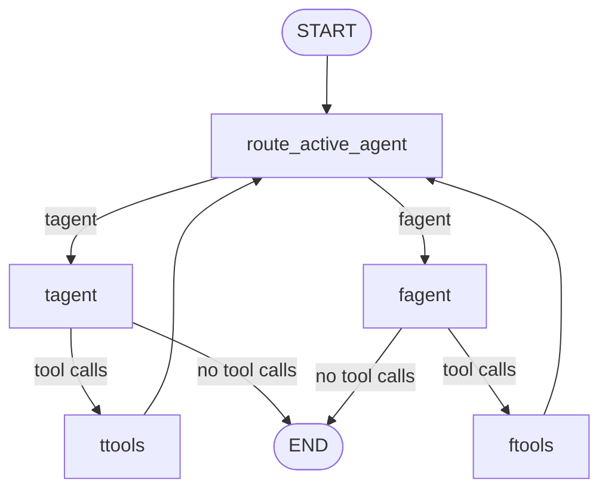

# MBTI primitive swarm simulation

한국어 | [English](./README.en.md)

이 폴더는 LangGraph primitives만 사용해 만든 학습용 MBTI T/F swarm simulation입니다. Architecture를 직접 보기 위해 `create_swarm`과 `create_react_agent`를 의도적으로 사용하지 않습니다.

## Graph shape



## 핵심 학습 포인트

Swarm은 두 agent node를 가진 하나의 parent graph입니다. Handoff는 tool result가 `active_agent`를 업데이트하고, tool 실행 뒤 router가 active agent로 제어권을 보내는 방식으로 구현합니다.

```text
handoff tool -> custom tool node -> active_agent update -> router -> next agent
```

## 파일

| 파일 | 책임 |
| --- | --- |
| `graph.py` | agent/tool/router node를 명시적으로 구현한 primitive swarm |
| `swarm_reference.py` | 비교 학습용 helper 기반 reference implementation |
| `README.reference.md` | primitive 방식과 helper 기반 방식을 비교하는 노트 |

## 상태

이 구현은 학습용 `simulation` capability입니다. 실제 MBTI 평가, 상담사, production decision system이 아닙니다.
