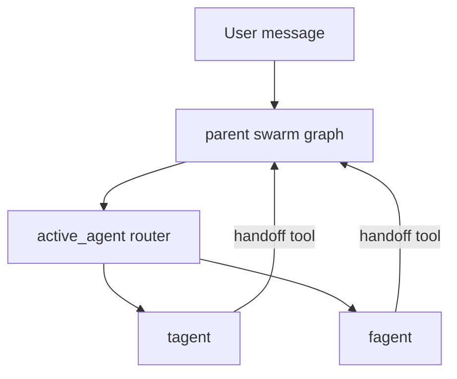

# MBTI swarm reference implementation

This note compares the original experimental `graph.py` with the separate reference implementation in `swarm_reference.py`.

## Key architectural idea

In LangGraph Swarm, the user is not usually a node. The parent swarm graph tracks the currently active agent and routes each user turn to that agent.

## What `swarm_reference.py` demonstrates

- `tagent` and `fagent` are compiled agents with stable names.
- Each agent has a handoff tool pointing to the other agent.
- `create_swarm(...)` creates the parent graph that owns active-agent routing.
- `InMemorySaver` is used because active-agent continuity is thread state.
- Model construction is lazy, so importing the module does not require OpenAI credentials.

## Compare with `graph.py`

`graph.py` is useful as a scratchpad, but it builds separate `tagent_graph` and `fagent_graph` values. That shape does not yet create the parent swarm graph that owns handoffs between agents.

Use `swarm_reference.py` when you want to study the canonical parent-swarm pattern.
