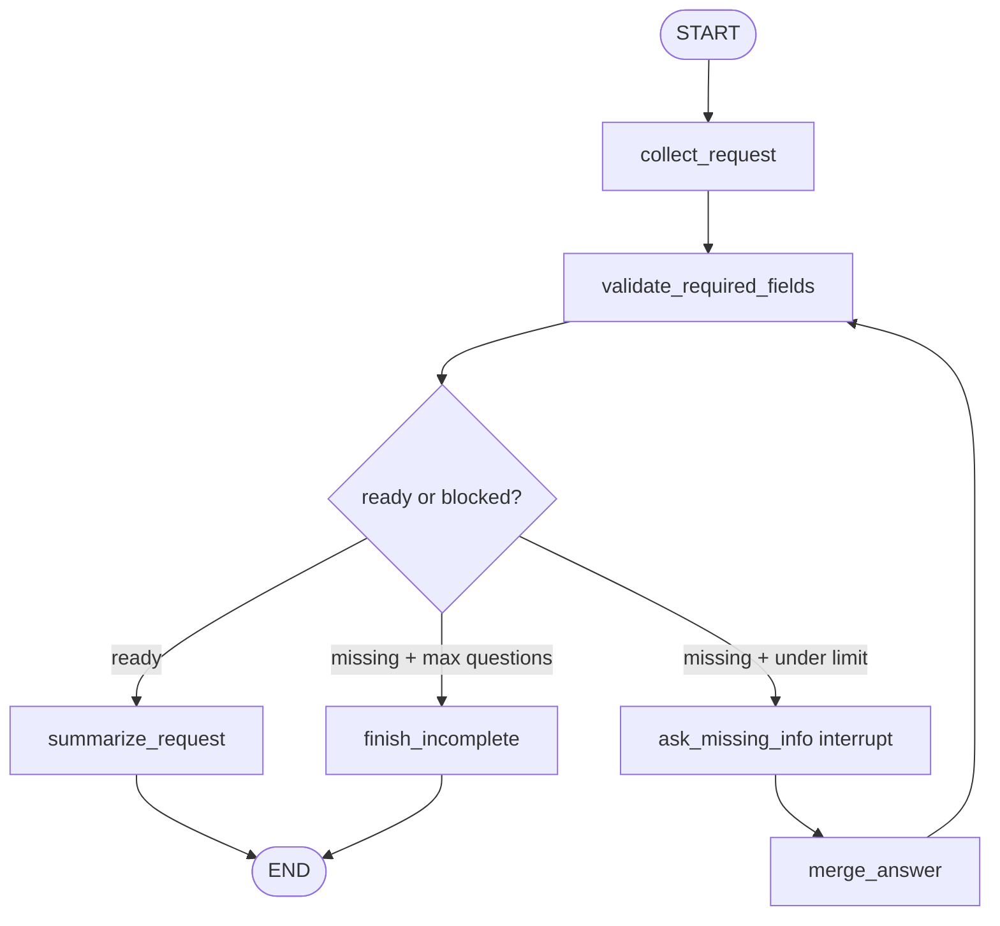

# Missing Info Interviewer implementation feedback

Review target: `simulated_agents/missing_info_interviewer/graph.py`

## Overall verdict

This one felt harder for a real reason: it is not just “use `interrupt`.” It is a **state lifecycle architecture** problem.

Your weak point is not the concept of interrupt/resume. Your weak point is designing the graph from the invariant backward:

> What state must exist before each node runs, what state does the node produce, and what terminal contract must be true when the graph ends?

That is a harder skill than writing individual nodes. The current refactored implementation has the right shape: deterministic extraction, validation, interrupt, merge, re-validation, and explicit terminal output.



## The exact weakness to work on

### 1. You started from “what should this node do?” instead of “what state transition is missing?”

The first implementation had reasonable pieces:

- analyzer;
- clarifier;
- interrupt;
- merge;
- summarize.

But the responsibilities overlapped. The clarifier was partly validating, partly asking, partly relying on an LLM. The analyzer and merge step both extracted information, but merge replaced earlier information instead of clearly preserving and updating the state.

For graph work, the better first question is:

```text
What state slot is missing right now?
```

Then each node gets one state transition:

```text
collect_request            user_request -> collected_info
validate_required_fields   collected_info -> missing_fields + ready flag
ask_missing_info           missing_fields -> last_answer, after resume
merge_answer               collected_info + last_answer -> collected_info
summarize_request          collected_info -> final_result
finish_incomplete          partial state -> final_result
```

If you can write that table before coding, the graph becomes much easier.

### 2. You treated “missing fields” as a property of extracted keys, not required schema

A common bug was this shape:

```python
missing_fields = []
for key in collected_info.keys():
    if key in REQUIRED_FIELDS and collected_info[key] != "":
        continue
    ...
```

That checks keys that already exist. But missingness must be computed from the required schema:

```python
missing_fields = [
    field for field in REQUIRED_FIELDS
    if not collected_info.get(field)
]
```

This is the most important architecture lesson from this exercise:

> Validation starts from the contract, not from the data you happened to receive.

### 3. You let LLM behavior hide graph-shape problems too early

Using `llm.with_structured_output(...)` is good when the schema and flow are already clear. But here the learning target was interrupt/resume architecture.

An LLM extractor adds noise:

- Did the graph fail?
- Did the LLM omit a key?
- Did the prompt confuse the schema?
- Did state get overwritten?
- Did validation compute the wrong fields?

For practice, start deterministic:

```text
goal=...; audience=...; deliverable=...; deadline=...
```

After the graph is architecturally correct, replace `parse_key_value_text(...)` with an LLM extractor.

### 4. You blurred “inside the graph” vs “caller around the graph”

This is the interrupt-specific weak spot.

Inside the graph:

```python
answer = interrupt(payload)
return {"last_answer": str(answer)}
```

Outside the graph:

```python
state = graph.invoke(initial_state, config=config)
while "__interrupt__" in state:
    payload = state["__interrupt__"][0].value
    answer = input(payload["question"])
    state = graph.invoke(Command(resume=answer), config=config)
```

The graph node prepares a payload and receives a resumed value. The CLI/frontend renders the payload and gathers input. Keeping those worlds separate is the main mental model.

### 5. You need to design terminal contracts explicitly

The earlier `final_result` issue showed the same pattern. In this graph, both successful and incomplete terminal paths must write `final_result`:

```text
summarize_request     -> final_result
finish_incomplete     -> final_result
```

Then the CLI can safely validate:

```python
return TerminalResult.model_validate(state).final_result
```

Do not rely on “we probably ended through the happy path.” Graphs need terminal invariants.

## What you did well

- You chose the right practice pattern after noticing interrupt still felt unclear.
- You understood that `interrupt(...)` returns a payload to the caller, not terminal input.
- You recognized that the problem was architectural, not just a syntax bug.
- You used explicit state fields instead of hiding everything in messages.
- You were willing to slow down instead of skipping the confusion. That is the correct move.

## How to improve: concrete drills

### Drill 1: Write the state transition table before coding

Before implementing any graph, write this table:

| Node | Requires | Produces | Must not do |
| --- | --- | --- | --- |
| collect_request | `user_request` | `collected_info`, `question_count` | ask user |
| validate_required_fields | `collected_info` | `missing_fields`, `ready_to_summarize`, `next_question` | merge answer |
| ask_missing_info | `next_question`, `missing_fields` | `last_answer`, `question_count` | call `input()` |
| merge_answer | `last_answer`, `collected_info` | updated `collected_info` | decide completion |
| summarize_request | complete `collected_info` | `final_result` | ask follow-up |
| finish_incomplete | partial state | `final_result` | raise missing-output error |

If a node has two unrelated jobs, split it.

### Drill 2: Draw terminal paths and output contracts

For every route to `END`, answer:

```text
What key does the caller read after graph completion?
Which node guarantees that key exists?
```

For this graph:

```text
summarize_request -> END         guarantees final_result
finish_incomplete -> END         guarantees final_result
```

### Drill 3: Keep LLMs out until the skeleton passes

Build in this order:

1. deterministic parser;
2. deterministic validator;
3. interrupt/resume loop;
4. terminal output validation;
5. only then LLM extraction/question generation.

This isolates architectural mistakes from model-output mistakes.

### Drill 4: Label each state field by lifecycle

Use this format in comments or notes:

```python
class State(TypedDict):
    # Required input
    user_request: str

    # Produced by collect_request / merge_answer
    collected_info: NotRequired[dict[str, str]]

    # Produced by validate_required_fields
    missing_fields: NotRequired[list[str]]
    next_question: NotRequired[str]
    ready_to_summarize: NotRequired[bool]

    # Produced by ask_missing_info after resume
    last_answer: NotRequired[str]
    question_count: NotRequired[int]

    # Produced only by terminal nodes
    final_result: NotRequired[str]
```

That lifecycle view is the missing muscle.

## Suggested next learning target

Compare `graph.py` with `graph_reference.py`, focusing on these questions:

1. Can you explain why `validate_required_fields` does not ask the user directly?
2. Can you explain why `ask_missing_info` does not parse the answer?
3. Can you point to every node that can eventually lead to `END`?
4. Can you prove that every completed path writes `final_result`?
5. Can you replace the deterministic parser with an LLM extractor without changing the graph edges?

If yes, you have learned the architecture. If not, repeat this same graph with a different required-field set before moving to a harder interrupt pattern.
