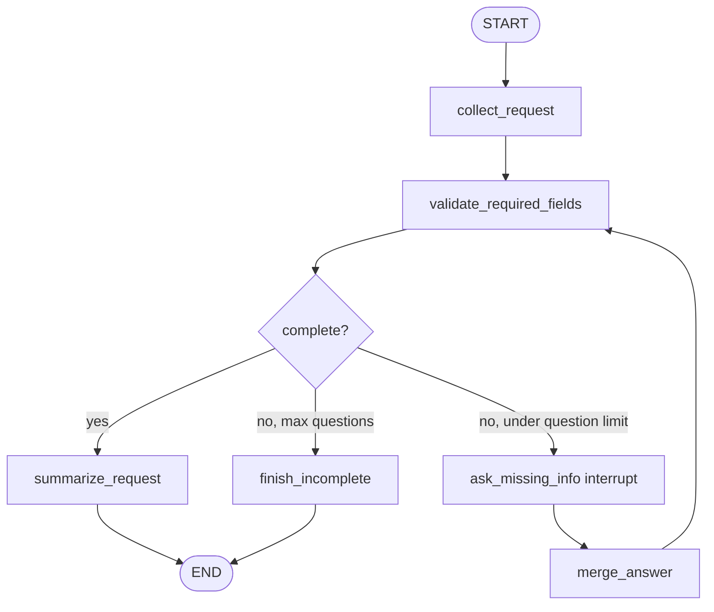

# Missing Info Interviewer simulated agent

[한국어](./README.md)

This folder is an agent development lab for practicing the **dynamic interrupt for missing required information** pattern.

`graph.py` currently contains only a bootstrap terminal loop. The goal is not production polish; the goal is to practice translating “validate input → ask for missing info → resume → validate again → finish” into LangGraph nodes, state, interrupt/resume, and stop conditions.

## Pattern to practice

```text
User
  ↓
Collect request
  ↓
Validate required fields
  ├── missing info → Ask missing info interrupt → Validate required fields
  └── complete → Summarize request → END
```

The core idea is that the graph should not guess when required information is missing. It should pause, ask a focused question, merge the resumed answer into state, and validate again.

- **Collect request**: extracts known fields from the original user request into state.
- **Validate required fields**: computes which fields are still missing.
- **Ask missing info interrupt**: returns only the missing-field question payload and waits for resume.
- **Merge answer**: merges the resumed answer into existing state and returns to validation.
- **Summarize request**: creates a clear structured summary once all fields are present.

## Agent goal

When the user enters an ambiguous task request, Missing Info Interviewer should check whether enough information is available. If something is missing, it should interrupt with one focused question, update state from the answer, and check again.

Example input:

```text
Help me prepare for tomorrow's meeting.
```

This request is usually missing:

- meeting topic or goal
- audience or attendees
- desired deliverable
- deadline or meeting time

## Required behavior

### 1. Collect request node

Collect request does not directly produce the final answer.

It preserves the original request in `user_request` and stores any confidently extracted fields in `collected_info`.

```python
{
    "user_request": "Help me prepare for tomorrow's meeting.",
    "collected_info": {
        "date_or_deadline": "tomorrow"
    },
}
```

Collect request responsibilities:

- preserve the original request;
- store only information that is actually present;
- avoid letting the LLM guess unknown values.

### 2. Validate required fields node

Validate required fields checks whether the current state has all required fields.

Start with a simple deterministic required-field list.

```python
REQUIRED_FIELDS = [
    "goal",
    "audience",
    "deliverable",
    "deadline",
]
```

Example state update:

```python
{
    "missing_fields": ["audience", "deliverable"],
    "next_question": "Who is the meeting for, and what output do you want?",
}
```

Validate responsibilities:

- explicitly compute missing fields;
- set `ready_to_summarize=True` when every field is present;
- create `next_question` when more information is needed.

### 3. Ask missing info interrupt node

Ask missing info uses `interrupt(...)` to pause graph execution.

Important: payload keys such as `question`, `missing_fields`, and `current_info` are not special to LangGraph. They are a payload convention for the caller/CLI/frontend to render.

```python
answer = interrupt(
    {
        "type": "missing_info_required",
        "question": state["next_question"],
        "missing_fields": state["missing_fields"],
        "current_info": state["collected_info"],
    }
)
```

Ask missing info responsibilities:

- do not call terminal `input()` inside the node;
- return a question payload and wait for graph resume;
- return the resumed answer so the next node can merge it into state.

### 4. Merge answer node

Merge answer combines the human resume value with existing `collected_info`.

The first implementation can avoid LLMs and use a simple key-value syntax.

```text
audience=backend study group; deliverable=agenda checklist
```

Example state update:

```python
{
    "collected_info": {
        "goal": "prepare for meeting",
        "audience": "backend study group",
        "deliverable": "agenda checklist",
        "deadline": "tomorrow",
    },
    "last_answer": "audience=backend study group; deliverable=agenda checklist",
}
```

### 5. Summarize request node

Summarize request runs only when every required field is present.

The final result is not task execution. It is a clear, actionable request summary.

```python
{
    "final_result": "Prepare an agenda checklist for tomorrow's backend study group meeting."
}
```

## Routing / loop rule

If validation is complete, route to Summarize request.

If information is missing, route to Ask missing info.

After Ask missing info resumes, route to Merge answer, then back to Validate.

Start with a maximum question count of 3 to avoid infinite interview loops.

```python
if ready_to_summarize:
    return "summarize_request"

if question_count >= 3:
    return "finish_incomplete"

return "ask_missing_info"
```

`finish_incomplete` must also write `final_result`. That prevents `KeyError: 'final_result'` at the CLI/API boundary.

## State design

Name the shared graph state `MissingInfoInterviewState`.

```python
class MissingInfoInterviewState(TypedDict):
    user_request: str
    collected_info: NotRequired[dict[str, str]]
    missing_fields: NotRequired[list[str]]
    next_question: NotRequired[str]
    last_answer: NotRequired[str]
    question_count: NotRequired[int]
    ready_to_summarize: NotRequired[bool]
    final_result: NotRequired[str]
```

Only `user_request` is required initial input. The rest are node-produced fields, so start them as `NotRequired`.

## Draft graph



## Review artifacts

- `FEEDBACK.md`: learner-facing review that pinpoints the state lifecycle / interrupt architecture weak spot
- `graph_reference.py`: reference implementation where each node owns one state transition

## How to run

The current implementation runs without an OpenAI API key.

```bash
uv run python -m simulated_agents.missing_info_interviewer.graph
```

Exit with:

```text
/exit
```

After implementation, prefer debug logs like these for learning:

```text
[collect_request] extracting known fields
[validate_required_fields] checking missing fields
[ask_missing_info] received resumed answer
[merge_answer] merging resume value into state
[route] deciding next node
[summarize_request] writing final result
[finish_incomplete] ending with explicit incomplete result
```

## Learning points

This graph practices interrupt as “missing information collection,” not only as an approval gate.

- `interrupt(...)` is graph pause/resume, not `input()`.
- Interrupt payload keys are not reserved by LangGraph; they are a rendering convention for the caller.
- Resume values must be merged into state, then validation should run again.
- Both complete and incomplete terminal paths must write `final_result`.

This pattern is common in real agent systems:

- required fields are missing from a task request;
- destination, amount, or target must be confirmed before a tool call;
- form-filling assistants;
- safety policies require asking instead of guessing.

## Simulation boundaries

- Information extraction should start as deterministic rules or a simple parser.
- Do not create real calendar, email, ticket, or task side effects.
- Low-quality user answers may end with an incomplete result.

## Production promotion notes

To promote this simulated agent into a real product feature, it would need:

- a checkpointer-backed interrupt/resume contract;
- a frontend/API protocol for rendering interrupt payloads and submitting resume values;
- required-field schema versioning;
- Pydantic validation for collected fields;
- timeout/cancel policy;
- tests for complete, incomplete, and max-question paths.

## Implementation constraints

- Keep the implementation mostly inline.
- Prefer understanding LangGraph primitives over reusable wrapper functions.
- Do not connect this simulated graph to the production API/CLI surface.
- Do not add real external side effects.
- Debug prints may intentionally remain for learning.
