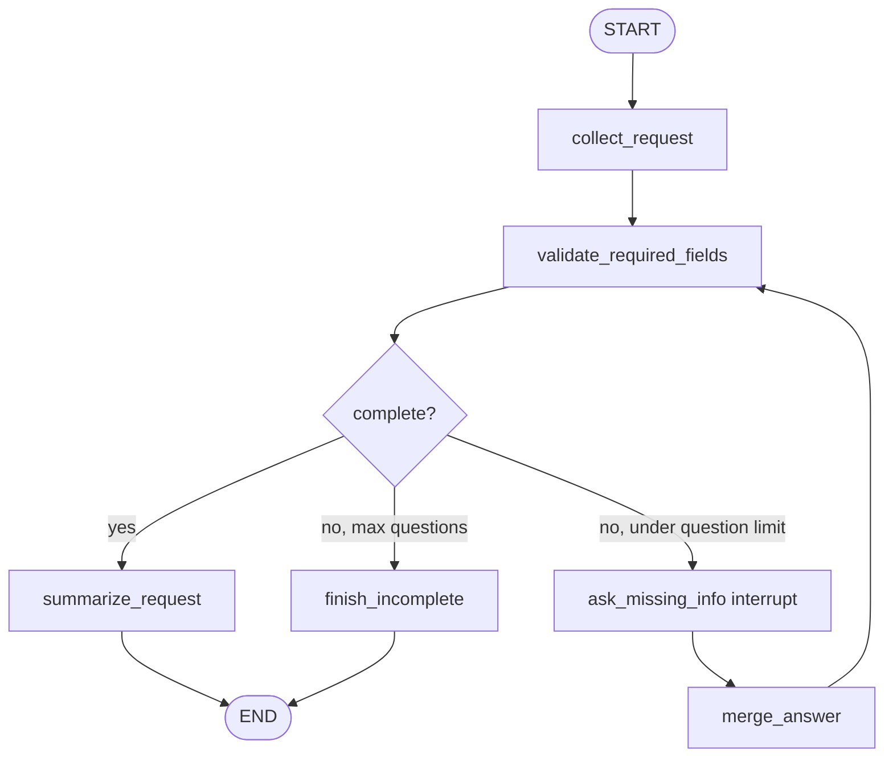

# Missing Info Interviewer simulated agent

[English](./README.en.md)

이 폴더는 **dynamic interrupt for missing required information** 패턴을 연습하기 위한 에이전트 개발 랩입니다.

`graph.py`는 현재 bootstrap terminal loop만 포함합니다. 구현 목적은 프로덕션 품질보다 “입력 검증 → 부족한 정보 질문 → resume → 재검증 → 완료” 흐름을 LangGraph 노드, 상태, interrupt/resume, 종료 조건으로 직접 번역하는 연습입니다.

## 연습할 패턴

```text
User
  ↓
Collect request
  ↓
Validate required fields
  ├── missing info → Ask missing info interrupt → Validate required fields
  └── complete → Summarize request → END
```

이 패턴의 핵심은 그래프가 필요한 정보가 부족할 때 추측하지 않고 멈춘 뒤, 사람에게 딱 필요한 질문을 하고, resume된 답변을 상태에 합쳐 다시 검증하는 것입니다.

- **Collect request**: 사용자 원문에서 가능한 필드를 추출해 상태에 저장합니다.
- **Validate required fields**: 어떤 필드가 아직 부족한지 계산합니다.
- **Ask missing info interrupt**: 부족한 필드만 질문 payload로 돌려주고 resume 값을 기다립니다.
- **Merge answer**: resume된 답변을 기존 상태에 합친 뒤 다시 검증합니다.
- **Summarize request**: 모든 필드가 준비되었을 때 최종 structured summary를 만듭니다.

## 에이전트 목표

사용자가 모호한 작업 요청을 입력하면, Missing Info Interviewer는 필요한 정보가 충분한지 확인해야 합니다. 부족하면 interrupt로 한 번에 하나의 명확한 질문을 하고, 답변이 들어오면 상태를 업데이트한 뒤 다시 확인합니다.

예시 입력:

```text
내일 회의 준비 좀 도와줘.
```

이 요청은 보통 다음 정보가 부족합니다.

- 회의 주제
- 참석자 또는 대상
- 원하는 산출물
- 마감/회의 시간

## 요구 동작

### 1. Collect request node

Collect request는 사용자에게 바로 최종 답변하지 않습니다.

사용자 원문을 `user_request`로 유지하고, 추출 가능한 필드를 `collected_info`에 저장합니다.

```python
{
    "user_request": "내일 회의 준비 좀 도와줘.",
    "collected_info": {
        "date_or_deadline": "tomorrow"
    },
}
```

Collect request 책임:

- 원문 요청을 잃어버리지 않습니다.
- 확실히 알 수 있는 정보만 저장합니다.
- 모르는 값을 LLM이 추측하지 않도록 합니다.

### 2. Validate required fields node

Validate required fields는 현재 상태에서 필요한 필드가 모두 있는지 검사합니다.

처음에는 단순한 deterministic required field 목록으로 시작합니다.

```python
REQUIRED_FIELDS = [
    "goal",
    "audience",
    "deliverable",
    "deadline",
]
```

상태 업데이트 예시:

```python
{
    "missing_fields": ["audience", "deliverable"],
    "next_question": "Who is the meeting for, and what output do you want?",
}
```

Validate 책임:

- 부족한 필드를 명시적으로 계산합니다.
- 모든 필드가 있으면 `ready_to_summarize=True`를 설정합니다.
- 질문이 필요한 경우 `next_question`을 만듭니다.

### 3. Ask missing info interrupt node

Ask missing info는 `interrupt(...)`를 사용해서 그래프 실행을 멈춥니다.

중요: interrupt payload의 `question`, `missing_fields`, `current_info` 같은 key는 LangGraph가 특별하게 해석하지 않습니다. caller/CLI/frontend가 보기 좋게 렌더링하기 위한 payload convention입니다.

```python
answer = interrupt(
    {
        "type": "missing_info_required",
        "question": state["next_question"],
        "missing_fields": state["missing_fields"],
        "current_info": state["collected_info"],
    }
)
```

Ask missing info 책임:

- 실제 terminal `input()`을 직접 호출하지 않습니다.
- 질문 payload만 반환하고 graph resume을 기다립니다.
- resume된 답변은 다음 node가 상태에 합칠 수 있도록 반환합니다.

### 4. Merge answer node

Merge answer는 interrupt resume 값으로 받은 사람의 답변을 기존 `collected_info`에 합칩니다.

초기 구현은 LLM 없이 간단한 key-value 문법으로 시작할 수 있습니다.

```text
audience=backend study group; deliverable=agenda checklist
```

상태 업데이트 예시:

```python
{
    "collected_info": {
        "goal": "prepare for meeting",
        "audience": "backend study group",
        "deliverable": "agenda checklist",
        "deadline": "tomorrow",
    },
    "last_answer": "audience=backend study group; deliverable=agenda checklist",
}
```

### 5. Summarize request node

Summarize request는 모든 required field가 채워진 뒤에만 실행합니다.

최종 결과는 사용자 요청을 실행하는 것이 아니라, 실행 가능한 명확한 요청 요약입니다.

```python
{
    "final_result": "Prepare an agenda checklist for tomorrow's backend study group meeting."
}
```

## 라우팅 / 반복 규칙

Validate 결과가 complete이면 Summarize request로 갑니다.

부족한 정보가 있으면 Ask missing info로 갑니다.

Ask missing info가 resume되면 Merge answer로 가고, 다시 Validate로 돌아갑니다.

무한 질문 루프를 막기 위해 최대 질문 횟수는 3번으로 시작합니다.

```python
if ready_to_summarize:
    return "summarize_request"

if question_count >= 3:
    return "finish_incomplete"

return "ask_missing_info"
```

`finish_incomplete`도 반드시 `final_result`를 만들어야 합니다. 그래야 CLI/API boundary에서 `KeyError: 'final_result'`가 나지 않습니다.

## 상태 설계

공유 그래프 상태 이름은 `MissingInfoInterviewState`로 둡니다.

```python
class MissingInfoInterviewState(TypedDict):
    user_request: str
    collected_info: NotRequired[dict[str, str]]
    missing_fields: NotRequired[list[str]]
    next_question: NotRequired[str]
    last_answer: NotRequired[str]
    question_count: NotRequired[int]
    ready_to_summarize: NotRequired[bool]
    final_result: NotRequired[str]
```

`user_request`만 initial input으로 required입니다. 나머지는 node가 만들어내는 값이므로 `NotRequired`로 시작합니다.

## 그래프 초안



## Review artifacts

- `FEEDBACK.md`: 구현 과정에서 어려웠던 state lifecycle / interrupt architecture 약점을 짚는 learner-facing review
- `graph_reference.py`: 각 node가 하나의 state transition만 담당하도록 정리한 reference implementation

## 실행 방법

현재 구현은 OpenAI API 키 없이 실행됩니다.

```bash
uv run python -m simulated_agents.missing_info_interviewer.graph
```

종료:

```text
/exit
```

구현 후에는 학습을 위해 다음 debug 로그를 출력하는 것을 권장합니다.

```text
[collect_request] extracting known fields
[validate_required_fields] checking missing fields
[ask_missing_info] received resumed answer
[merge_answer] merging resume value into state
[route] deciding next node
[summarize_request] writing final result
[finish_incomplete] ending with explicit incomplete result
```

## 학습 포인트

이 그래프는 interrupt를 “승인 게이트”가 아니라 “부족한 정보 수집”에 사용하는 연습입니다.

- `interrupt(...)`는 `input()`이 아니라 graph pause/resume입니다.
- interrupt payload key는 LangGraph 예약어가 아니라 caller가 렌더링할 convention입니다.
- resume 값은 상태에 합쳐져야 하며, 그 뒤 다시 validation node로 돌아가야 합니다.
- complete와 incomplete terminal path 모두 `final_result`를 만들어야 합니다.

이 패턴은 실제 agent 시스템에서도 자주 쓰입니다.

- 작업 요청에 필수 필드가 빠졌을 때
- tool call 전에 destination, amount, target 같은 값을 확인할 때
- form-filling assistant
- 안전 정책상 추측하면 안 되는 값을 사람에게 물어야 할 때

## Simulation 경계

- 정보 추출은 처음에는 deterministic rule 또는 간단한 parser로 시뮬레이션합니다.
- 실제 calendar, email, ticket creation 같은 side effect는 하지 않습니다.
- 사용자의 답변 품질이 낮으면 incomplete result로 종료할 수 있습니다.

## Production으로 승격하려면

이 simulated agent를 실제 제품 기능으로 승격하려면 다음이 필요합니다.

- checkpointer-backed interrupt/resume contract
- frontend/API가 interrupt payload를 렌더링하고 resume 값을 보내는 protocol
- required field schema versioning
- Pydantic validation for collected fields
- timeout/cancel policy
- complete, incomplete, max-question 경로 테스트

## 구현 제약

- 가능한 한 inline 코드로 구현합니다.
- 재사용 가능한 wrapper 함수보다 LangGraph primitive 이해를 우선합니다.
- 프로덕션 API/CLI surface로 연결하지 않습니다.
- 실제 외부 side effect를 만들지 않습니다.
- debug print는 학습을 위해 의도적으로 남겨둘 수 있습니다.
