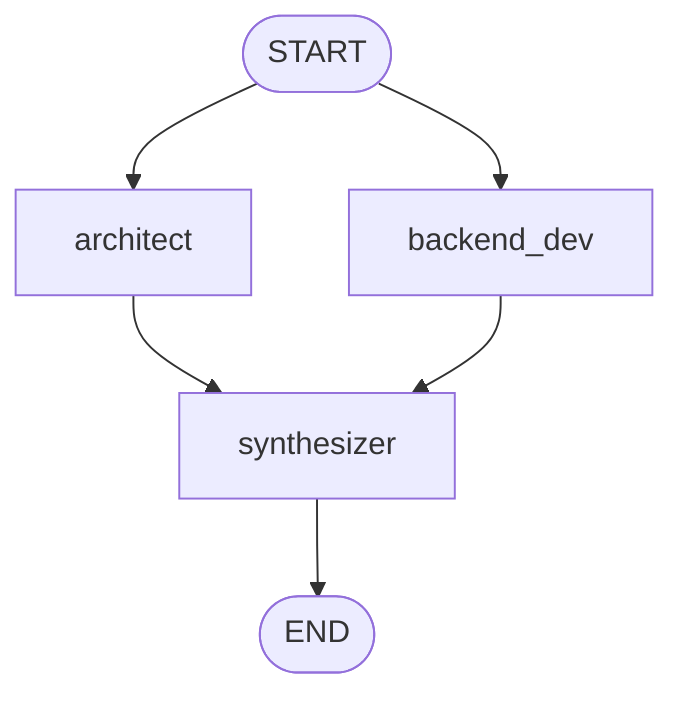

# Reducer Playground implementation feedback

Review target: `simulated_agents/reducer_playground/graph.py`

## Overall verdict

Your graph now has the correct learning shape for reducer practice:



The most important reducer bug is fixed: worker nodes now return `notes` as `list[str]`, which matches `Annotated[list[str], operator.add]`.

The remaining improvements are about making the graph easier to type-check, easier to run without credentials, and clearer about input/internal/output state boundaries.

## What you did well

- You picked the right graph shape for reducer practice: parallel branches write into one shared `notes` channel.
- `notes: Annotated[list[str], operator.add]` is the correct reducer pattern for accumulating branch outputs.
- `backend_dev()` and `architect()` now return `{"notes": [text]}`, not `{"notes": text}`.
- `synthesizer()` correctly treats `notes` as a list and joins it before final synthesis.
- `respond()` is a thin CLI adapter, which is acceptable for the bootstrap/user implementation path.

## Main issues to improve

### 1. Add explicit node return types so static checkers can catch reducer-shape bugs

The runtime error you saw came from returning a string into a reducer channel that expects lists.

This is hard for a static checker to catch if node functions have no return annotation:

```python
def backend_dev(state: ReducerPlaygroundState):
    return {"notes": "one string"}
```

Prefer a small update `TypedDict`:

```python
class NotesUpdate(TypedDict):
    notes: list[str]


def backend_dev(state: ReducerPlaygroundState) -> NotesUpdate:
    return {"notes": ["one note"]}
```

Then a checker such as basedpyright or mypy can catch `str` where `list[str]` is expected.

### 2. Keep state separation visible in the reference implementation

Your current `graph.py` uses one state schema for everything:

```python
class ReducerPlaygroundState(TypedDict):
    question: str
    notes: Annotated[list[str], operator.add]
    final_summary: NotRequired[str]
```

That is fine for learning and I would not force you to change it immediately.

However, the reference implementation should show a more production-shaped separation:

- input schema: what the caller provides;
- internal state schema: what nodes use while running;
- output schema: what the caller gets back.

That distinction is now demonstrated in `graph_reference.py`.

### 3. Consider making the reference deterministic/offline

Your implementation uses `ChatOpenAI` at module import time, so running it requires credentials before the graph can even start.

That is fine when practicing OpenAI-backed nodes, but for reducer learning the core concept does not require a live model. The reference implementation uses deterministic fake workers so you can study reducer behavior credential-free.

### 4. Prompt and spelling cleanup

Small wording issues do not block the learning goal, but they can distract later:

- `beckend` -> `backend`
- `Make notes or opinion` -> `Make notes or opinions`
- prompt indentation can be tightened with concise strings

These are style-level issues, not architecture blockers.

## Suggested next learning target

Compare `graph.py` with `graph_reference.py`, focusing on:

1. worker update return types;
2. reducer-compatible output shape: `list[str]`, not `str`;
3. input/internal/output state separation;
4. deterministic fake workers vs OpenAI-backed workers;
5. direct `graph.invoke(...)` in the reference CLI versus thin `respond()` in the bootstrap CLI.
