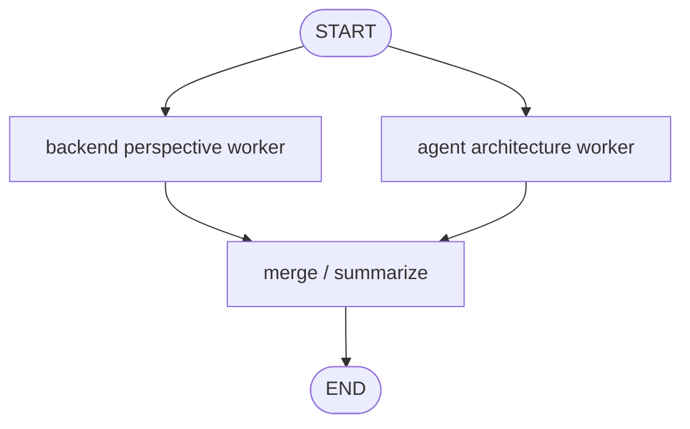

# Reducer Playground simulated agent

[한국어](./README.md) | English

This folder is a bootstrap space for **Reducer Playground**, a learning-only simulated agent.

Reducer Playground practices what happens when multiple graph branches update the same state key: without a reducer, values overwrite or conflict; with a reducer, branch outputs can merge. `graph.py` now contains the user-written OpenAI-backed implementation, and `graph_reference.py` provides a deterministic reference that demonstrates reducer-safe return types and input/internal/output state separation.

## Goal

- LangGraph pattern to practice: state reducers and parallel merge rules
- Difficulty: Beginner
- Example user input: `Compare FastAPI and LangGraph as backend learning topics.`
- Expected output or behavior: two or more fake workers generate evidence/notes for the same question, merge them into reducer-backed state, then create a final summary.

## Draft graph

## Key learning points

- See why reducers matter when multiple branches update the same state key.
- Practice merge rules such as `Annotated[list[str], operator.add]`.
- Worker nodes should read only the input they need and return a consistent output shape.
- Start with deterministic fake workers, then optionally extend to OpenAI-backed workers.

## Draft key state fields

| Field | Meaning |
| --- | --- |
| `question` | The user's original question |
| `notes` | Notes/evidence accumulated by multiple branches |
| `final_summary` | Final answer synthesized from merged notes |

## File responsibilities

| File | Responsibility |
| --- | --- |
| `graph.py` | User-written OpenAI-backed Reducer Playground graph implementation |
| `graph_reference.py` | Deterministic reference implementation showing reducer-safe return types and state separation |
| `FEEDBACK.md` | Review notes and improvement points for the current implementation |
| `README.md` | Korean learning note and implementation plan |
| `README.en.md` | English learning note and implementation plan |
| `__init__.py` | Simulation package marker |

## Implementation notes

- Do not connect this simulation to production API/CLI surfaces.
- Prefer fake worker outputs over real search, databases, or external APIs.
- The learning value is stronger if the implementation makes the difference between reducer and non-reducer behavior visible.
- After implementation, update this README with the real graph flow, reducer state contract, and fake/simulation boundaries.
