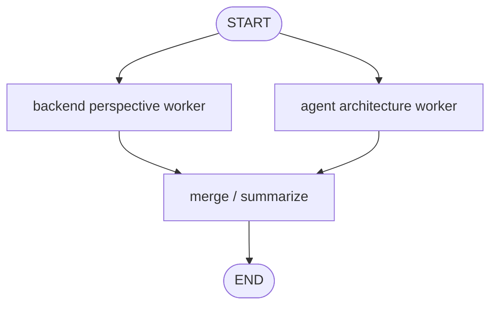

# Reducer Playground simulated agent

[English](./README.en.md)

이 폴더는 **학습 전용 simulated agent**인 Reducer Playground를 만들기 위한 부트스트랩 공간입니다.

Reducer Playground는 여러 graph branch가 같은 state key를 업데이트할 때, reducer가 없으면 값이 덮어써지고 reducer가 있으면 값이 병합되는 차이를 연습합니다. 현재 `graph.py`는 사용자가 작성한 OpenAI-backed 구현이며, `graph_reference.py`는 reducer-safe return type과 input/internal/output state separation을 보여주는 deterministic 참고 구현입니다.

## 목표

- 연습할 LangGraph 패턴: state reducers and parallel merge rules
- 난이도: Beginner
- 사용자 입력 예시: `Compare FastAPI and LangGraph as backend learning topics.`
- 기대 출력 또는 동작: 두 개 이상의 fake worker가 같은 질문에 대한 evidence/note를 생성하고, reducer-backed state에 병합한 뒤 final summary를 만듭니다.

## 그래프 초안

## 핵심 학습 포인트

- 같은 state key를 여러 branch가 업데이트할 때 reducer가 왜 필요한지 확인합니다.
- `Annotated[list[str], operator.add]` 같은 merge rule을 연습합니다.
- worker node는 전체 state가 아니라 필요한 입력만 읽고 일관된 output shape을 반환해야 합니다.
- 먼저 deterministic fake worker로 구현한 뒤, 필요하면 OpenAI-backed worker로 확장합니다.

## 핵심 상태 필드 초안

| 필드 | 의미 |
| --- | --- |
| `question` | 사용자의 원래 질문 |
| `notes` | 여러 branch가 병합해서 쌓는 note/evidence 목록 |
| `final_summary` | 병합된 notes를 요약한 최종 답변 |

## 파일 책임

| 파일 | 책임 |
| --- | --- |
| `graph.py` | 사용자가 작성한 OpenAI-backed Reducer Playground graph 구현 |
| `graph_reference.py` | reducer-safe return type과 state separation을 보여주는 deterministic 참고 구현 |
| `FEEDBACK.md` | 현재 구현에 대한 리뷰와 개선 포인트 |
| `README.md` | 한국어 학습 노트와 구현 계획 |
| `README.en.md` | English learning note and implementation plan |
| `__init__.py` | simulation package marker |

## 구현 메모

- 프로덕션 API/CLI surface에 연결하지 마세요.
- 실제 검색, DB, 외부 API 대신 fake worker output을 우선하세요.
- reducer가 있는 버전과 없는 버전의 차이를 코드나 출력에서 볼 수 있게 만들면 학습 효과가 좋습니다.
- 구현 후 이 README에 실제 graph flow, reducer state contract, fake/simulation 경계를 업데이트하세요.
