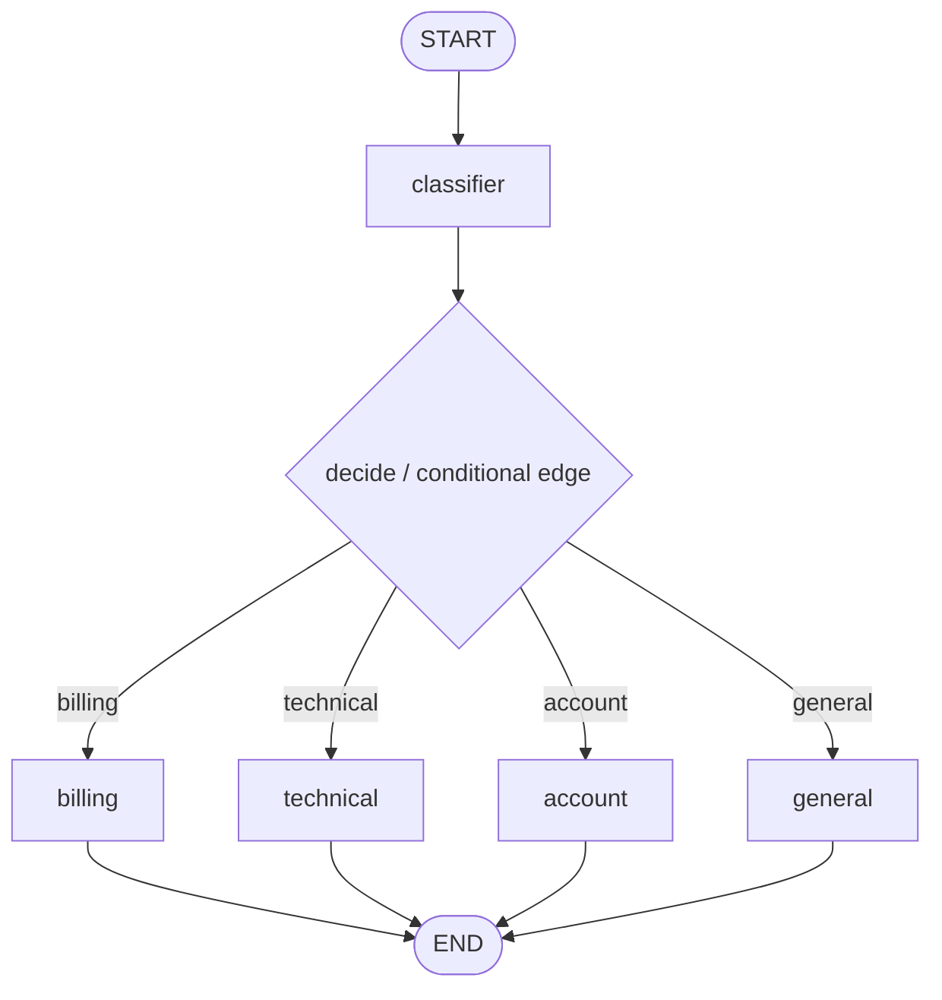

# Support Ticket Router implementation feedback

Review target: `simulated_agents/support_ticket_router/graph.py`

## Overall verdict

You have the right conceptual LangGraph shape for conditional routing: one classifier node writes a route decision, then a routing function chooses exactly one response node.



The biggest improvement is not architectural; it is about making the state contract simpler and making the streaming boundary explicit.

## What you did well

- The `classifier` node writes a structured `RouteDecision`, which is a good fit for conditional routing.
- `RouteDecision.model_validate(raw_decision)` is the right move because LangChain's structured-output type is broader than Pylance can prove.
- The `decide` function correctly returns the route label instead of doing response work itself.
- The graph uses `graph.stream(..., stream_mode="messages")`, which is the correct direction for token-like terminal output.
- The CLI no longer wraps `respond(user_input)` in `print(...)`, so streamed chunks are not duplicated.

## Main issues to improve

### 1. Avoid pseudo-state classes for node inputs

These classes are adding noise:

```python
class ClassifierState(TypedDict):
    ticket: str

class DecisionState(TypedDict):
    route_decision: RouteDecision
```

LangGraph passes the current graph state to node and routing functions. Even if a node only reads `ticket`, its input type can still be the full state:

```python
def billing(state: SupportTicketRouterState) -> dict[str, str]:
    ticket = state["ticket"]
    ...
```

Use narrower public input/output schemas at the graph boundary if you want separation. Do not create many tiny input states for every node unless the graph is a subgraph or the narrower schema is truly a public contract.

### 2. Add an explicit conditional edge map

Your route labels currently match node names, so `add_conditional_edges("classifier", decide)` may work. For learning clarity, prefer an explicit map:

```python
builder.add_conditional_edges(
    "classifier",
    decide,
    {
        "billing": "billing",
        "technical": "technical",
        "account": "account",
        "general": "general",
    },
)
```

This makes it obvious that `decide()` returns labels and LangGraph maps those labels to nodes.

### 3. Keep the route function typed against the full state

Prefer:

```python
def decide(
    state: SupportTicketRouterState,
) -> Literal["billing", "technical", "account", "general"]:
    return state["route_decision"].route
```

That teaches the right invariant: after `classifier`, `route_decision` exists.

### 4. Streaming is a CLI concern, not node state

Your current `respond()` streams message chunks and returns the joined text. That is okay as a thin CLI adapter.

The important boundary is:

```text
nodes update graph state
respond() prints streamed LLM chunks for terminal UX
```

Do not put terminal printing deep inside response nodes if your goal is clean graph state. Let the graph stream messages and let the CLI decide what to print.

### 5. Prompt and formatting cleanup

Ruff will flag import order, blank lines, and long lines. Also consider prompt wording:

- `where to redirect` -> `which support route should handle it`;
- `a account manager` -> `an account manager`;
- avoid `f"..."` when there is no interpolation.

These are not the core learning issue, but they make the implementation easier to read.

## Suggested next learning target

Compare `graph.py` with `graph_reference.py`, focusing on:

1. full graph state as node input;
2. public input/internal state/output schema separation;
3. explicit conditional route map;
4. `graph.stream(..., stream_mode="messages")` for terminal streaming;
5. keeping `respond()` as a thin CLI streaming adapter.
