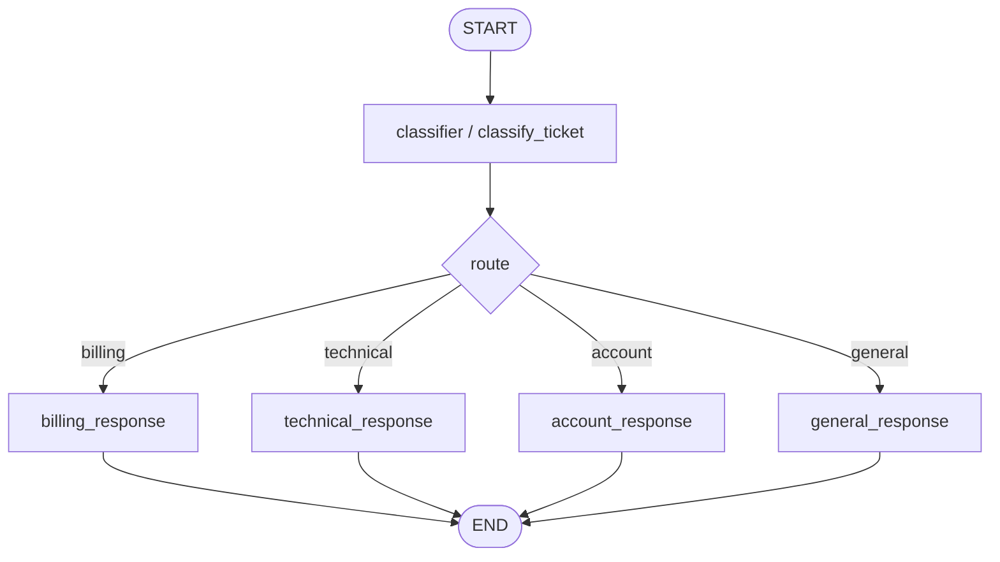

# Support Ticket Router simulated agent

[한국어](./README.md) | English

This folder is a workspace for a **learning-only simulated agent**.

`graph.py` is the user's conditional-routing practice graph. `graph_reference.py` is a comparison artifact that shows the same pattern in a more experienced AI-engineer style.

## Goal

- LangGraph pattern to practice: conditional routing
- Example user input: "I can log in, but I cannot find my billing receipt."
- Expected output or behavior: classify the ticket, then route to one of `billing`, `technical`, `account`, or `general`.

## Graph flow



## Key state

```python
class RouteDecision(BaseModel):
    route: Literal["billing", "technical", "account", "general"]
    reason: str


class SupportTicketRouterState(TypedDict):
    ticket: str
    route_decision: NotRequired[RouteDecision]
    final_response: NotRequired[str]
```

## File responsibilities

| File | Responsibility |
| --- | --- |
| `graph.py` | User-written OpenAI-backed conditional-routing graph and terminal streaming adapter |
| `graph_reference.py` | Reference implementation showing public/internal/output state separation, explicit conditional edge mapping, and final-node message streaming |
| `FEEDBACK.md` | Learner-facing review of the current implementation |
| `README.md` | Korean learning note and implementation plan |
| `README.en.md` | English learning note and implementation plan |
| `__init__.py` | Simulation package marker |

## Implementation notes

- Do not connect this simulation to production API/CLI surfaces.
- Prefer fake/stub boundaries over real external side effects.
- Verify that route labels and the conditional edge map match exactly.
- Keep `respond()` or `stream_response()` as a thin CLI adapter, and keep graph nodes focused on state updates.
- `stream_mode="messages"` is a terminal UX layer for LLM chunks. Store only the final string in graph state.
