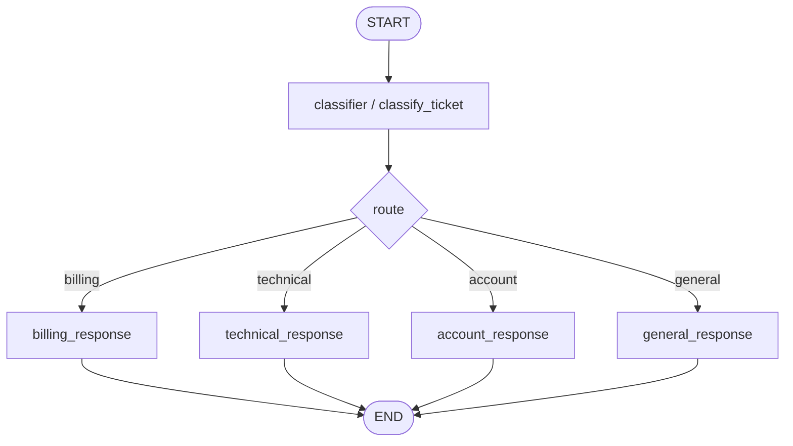

# Support Ticket Router simulated agent

[English](./README.en.md)

이 폴더는 **학습 전용 simulated agent**를 만들기 위한 공간입니다.

`graph.py`는 사용자가 직접 구현한 conditional-routing 연습 그래프입니다. `graph_reference.py`는 같은 패턴을 더 경험 있는 AI engineer 스타일로 정리한 비교용 reference입니다.

## 목표

- 연습할 LangGraph 패턴: conditional routing
- 사용자 입력 예시: "로그인은 되는데 결제 영수증을 찾을 수 없어요."
- 기대 출력 또는 동작: ticket을 분류한 뒤 `billing`, `technical`, `account`, `general` 중 하나의 응답 노드로 라우팅합니다.

## 그래프 흐름



## 핵심 상태

```python
class RouteDecision(BaseModel):
    route: Literal["billing", "technical", "account", "general"]
    reason: str


class SupportTicketRouterState(TypedDict):
    ticket: str
    route_decision: NotRequired[RouteDecision]
    final_response: NotRequired[str]
```

## 파일 책임

| 파일 | 책임 |
| --- | --- |
| `graph.py` | 사용자가 구현한 OpenAI-backed conditional-routing 그래프와 terminal streaming adapter |
| `graph_reference.py` | public/internal/output state 분리, 명시적 conditional edge map, final-node message streaming을 보여주는 reference 구현 |
| `FEEDBACK.md` | 현재 구현에 대한 learner-facing review |
| `README.md` | 한국어 학습 노트와 구현 계획 |
| `README.en.md` | English learning note and implementation plan |
| `__init__.py` | simulation package marker |

## 구현 메모

- 프로덕션 API/CLI surface에 연결하지 마세요.
- 실제 외부 side effect 대신 fake/stub boundary를 우선하세요.
- route label과 conditional edge map이 정확히 맞는지 확인하세요.
- `respond()` 또는 `stream_response()`는 얇은 CLI adapter로 유지하고, graph node는 state update에 집중시키세요.
- `stream_mode="messages"`는 LLM chunk를 터미널에 출력하기 위한 UX layer입니다. graph state에는 최종 문자열만 저장하세요.
